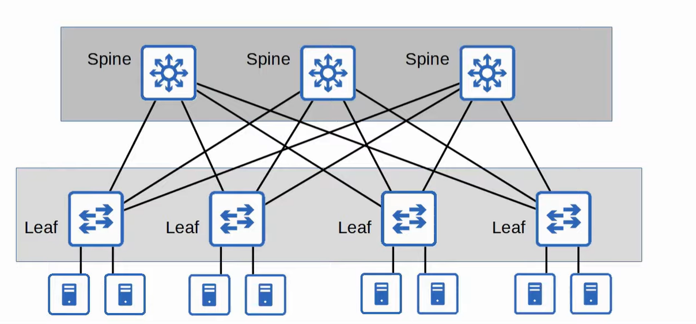

- Internet 的成功, 尤其是 Web 技术的成功, 意味着网络上的在线信息已经由涓涓细流变成了消防水喉一样的洪流。如何从大量信息中寻找相关信息变得至关重要。在这种背景下, 搜索引擎之间的争夺开始了。虽然 Google 进入这个领域的时间比其他搜索引擎晚很多, 但它最终超过了所有竞争对手。就像施乐曾经是影印的同义词一样 (目前在世界某些地区仍是如此), Google 也被收录进入了词典, 成为 Web 搜索的同义词。在撰写本文时, Google 每天处理 35 亿次搜索, 平均每秒 40000 次。为了应对如此大的规模, 新的技术, 尤其是基于集群的应用程序架构 (例如 MapReduce) 变得非常重要。在这个背景下, 应用程序开始从客户端-服务器通信模式到服务器-服务器通信模式的历史性转变

 解读：历史性的转变 (The Historic Shift)
  - 传统“客户端-服务器”模式 (Client-Server)
    - 流量模型：南北向流量 (North-South Traffic) 为主。意思是，流量主要是从数据中心外部的用户（Client）流向数据中心内部的某台服务器（Server），然后返回。数据中心内部服务器之间的通信相对较少。
    - 网络设计：在这种模型下，网络设计的重点是边界。比如强大的防火墙、负载均衡器、和高速的互联网出口。数据中心内部的网络可以相对简单，比如经典的三层（核心-汇聚-接入）架构。
  - 现代“服务器-服务器”模式 (Server-Server)
    - 流量模型：东西向流量 (East-West Traffic) 成为主导。意思是，绝大部分网络流量都发生在数据中心内部的服务器与服务器之间。比如，一个Web服务器要向后面的缓存服务器、数据库服务器、认证服务器、日志服务器发起几十次调用，才完成对用户一次请求的响应。
    - 网络设计：经典的三层架构在这种模型下会遇到瓶颈（比如汇聚层交换机成为瓶颈）。为了让数据中心内任何两台服务器之间都能进行低延迟、高带宽、无阻塞的通信，催生了现代数据中心的Spine-Leaf（脊叶）网络架构。
- 当你后续学习到以下概念时，都可以回溯到这个“历史性转变”：
    - Spine-Leaf 架构：就是为了解决海量的“东西向流量”问题。
    - BGP in DC (数据中心BGP)：是为了在这种大规模扁平化网络中高效、自动地宣告和学习路由。
    - VXLAN (虚拟扩展局域网)：是为了在物理网络之上构建大规模、灵活的虚拟网络（租户隔离、虚拟机迁移等）。
    - SDN (软件定义网络) & 网络自动化：是因为网络规模太大，必须用软件和代码来集中管理和配置，而不是手动敲命令行。
    - Service Mesh (服务网格, 如Istio)：当应用被拆分成无数微服务后，“服务器-服务器”的通信变得极其复杂，Service Mesh就是在应用层和网络层之间提供服务发现、负载均衡、安全和可观察性。


## 数据中心架构演进
从“传统网络”思维转向“云原生/数据中心网络”思维的核心转变

### 1. 经典三层架构 (The Old Way)

想象一个传统的公司组织架构或者一个城市的交通系统。

*   **接入层 (Access Layer)**: 员工/市民。这里是服务器（Servers）接入网络的地方。
*   **汇聚层 (Aggregation/Distribution Layer)**: 部门经理/区域立交桥。它汇聚了来自多个接入交换机的流量。
*   **核心层 (Core Layer)**: CEO/市中心总枢纽。它连接着所有的汇聚层，是整个网络的中心骨干。

**架构图示 (简化版):**

```
                  +--------------+
                  |  核心交换机  |  (Core)
                  +--------------+
                   /      |       \
                  /       |        \
        +-----------+   +-----------+   +-----------+
        | 汇聚交换机A |   | 汇聚交换机B |   | 汇聚交换机C | (Aggregation)
        +-----------+   +-----------+   +-----------+
          /    \          /    \          /    \
         /      \        /      \        /      \
      +----+  +----+  +----+  +----+  +----+  +----+
      |接入|  |接入|  |接入|  |接入|  |接入|  |接入|  (Access)
      +----+  +----+  +----+  +----+  +----+  +----+
        |       |       |       |       |       |
      [Srv]   [Srv]   [Srv]   [Srv]   [Srv]   [Srv]  (Servers)
```

**问题在哪里？——当服务器之间需要频繁对话时 (东西向流量)**

假设`服务器1`（在汇聚A下面）需要和`服务器3`（在汇聚B下面）通信。流量路径是：

**服务器1 → 接入交换机 → 汇聚交换机A → 核心交换机 → 汇聚交换机B → 接入交换机 → 服务器3**

你看，这个路径非常长，要经过 **5个网络设备**。

**这就是瓶颈的来源：**

1.  **核心层成为必经之路和瓶颈 (Chokepoint)**: 任何跨汇聚层的服务器通信，**都必须经过核心层**。就像城市里所有跨区的车辆都必须经过市中心的那个大转盘一样。当数据中心内部有成千上万的服务器在疯狂地互相通信时（运行MapReduce、微服务调用等），核心交换机和连接它的链路很快就会被塞满，造成拥堵。

2.  **延迟高且不确定**: 路径太长了（5跳），每一跳都会增加延迟。而且因为核心层是共享的，网络拥堵情况会变化，导致延迟非常不稳定。

3.  **带宽浪费和阻塞**: 三层架构为了防止环路，会使用STP（生成树协议）等技术，这通常会**阻塞掉一些备用链路**，导致你花钱买的带宽不能被完全利用。流量只能走在单一的最优路径上。

**总结：三层架构是为“南北向”流量（服务器与外部用户通信）设计的，它的结构像一棵树，流量“向上”汇总很高效。但对于“东西向”流量（服务器之间互相通信），它效率低下，就像让两个邻近郊区的居民必须先开车到市中心才能互相拜访一样。**

---

### 2. Spine-Leaf (脊叶) 架构 (The New Way)

现在，我们换一种思路，设计一个专门为“东西向流量”优化的网络。我们不建“金字塔”，而是建一个“交通网格”。

*   **Leaf (叶) 层**: 相当于三层架构的接入层，服务器直接连接到这里。
*   **Spine (脊) 层**: 相当于一个超高速的互联骨干。

**架构图示 (简化版):**

```
        +---------+   +---------+   +---------+
        | Spine 1 |   | Spine 2 |   | Spine 3 |   (Spine)
        +---------+   +---------+   +---------+
         /  |  \       /  |  \       /  |  \
        /   |   \     /   |   \     /   |   \
       /    |    \   /    |    \   /    |    \
+-------+ +-------+ +-------+ +-------+ +-------+
| Leaf 1| | Leaf 2| | Leaf 3| | Leaf 4| | Leaf 5|   (Leaf)
+-------+ +-------+ +-------+ +-------+ +-------+
   |         |         |         |         |
 [Srv]     [Srv]     [Srv]     [Srv]     [Srv]
```

**连接规则非常简单且严格：**
1.  **每个Leaf交换机都连接到每一个Spine交换机。**
2.  Leaf之间**不**直接相连。Spine之间也**不**直接相连。
3.  服务器只连接到Leaf交换机。

**它是如何解决瓶颈的？**

现在，我们再看`服务器1`（在Leaf 1下）和`服务器3`（在Leaf 3下）的通信：

**服务器1 → Leaf 1 → (任意一个Spine交换机) → Leaf 3 → 服务器3**

**优势立刻显现：**

1.  **路径短且延迟固定**: 从任何一个服务器到另一个服务器，路径**永远是3跳**（Leaf-Spine-Leaf）。这使得延迟非常低，而且非常**可预测**。

2.  **没有单一瓶颈，带宽巨大**: 流量从Leaf 1到Leaf 3，可以走`Spine 1`，也可以走`Spine 2`，还可以走`Spine 3`。网络协议（如ECMP - 等价多路径）会自动将流量**负载均衡**到所有可用的路径上。Spine层的所有交换机和链路都在同时工作，极大地提高了整个网络的总带宽，消除了核心层的瓶颈。

3.  **易于水平扩展 (Scale-Out)**:
    *   需要更多服务器端口？**增加一个Leaf交换机**，然后把它连到所有的Spine上。
    *   发现Spine和Leaf之间的链路带宽不够了（东西向流量太大）？**增加一个Spine交换机**，然后把它连到所有的Leaf上。
    这种扩展方式非常简单、清晰，不会影响现有网络结构。

---

### 结论对比

| 特性 | 经典三层架构 | Spine-Leaf 架构 |
| :--- | :--- | :--- |
| **主要优化** | 南北向流量（Client-Server） | **东西向流量（Server-Server）** |
| **设备间跳数** | 不固定，可能很高（如5跳） | **固定为3跳**（跨Leaf通信） |
| **延迟** | 较高且不可预测 | **极低且可预测** |
| **瓶颈** | 核心层是明显瓶颈 | **通过多路径负载均衡，无明显瓶颈** |
| **带宽利用率** | 较低（STP阻塞链路） | **极高（所有链路都可用于转发）** |
| **扩展性** | 复杂，核心层升级昂贵 | **简单，按需添加Spine或Leaf即可** |

所以，书里那段话的逻辑就是：Google的海量计算需求 → 催生了MapReduce等分布式应用 → 分布式应用产生了海量的服务器间（东西向）流量 → 原有的三层网络架构扛不住了 → 为了支撑这种流量模型，Spine-Leaf架构应运而生，并成为现代云数据中心的标准网络架构。

这就是为什么Spine-Leaf是为了“让数据中心内任何两台服务器之间都能进行低延迟、高带宽、无阻塞的通信”而设计的了。


## 汇聚交换机代表了网络的边界
这里的“边界”主要指的是 二层网络（广播域）和三层网络（路由域）之间的分界线
1. 从“寻址方式”来看：MAC地址 vs IP地址的边界
- 边界之内（南向，朝向服务器）：在这个区域里，网络通信主要依靠二层MAC地址。一台服务器要和另一台在同一个VLAN里的服务器通信，它会通过ARP协议找到对方的MAC地址，然后交换机根据MAC地址表直接进行“桥接”或“交换”。这就像一个大社区里的居民，互相之间喊名字（MAC地址）就能找到对方。
- 边界之外（北向，朝向核心网或Internet）：一旦数据包需要离开这个“社区”（比如要去另一个VLAN或者访问外网），它就不能再靠喊名字了。它必须被送到社区的“大门口”。这个大门口就是配置在汇聚交换机上的网关（Gateway）。从这里开始，数据包的转发不再看MAC地址，而是看它的三层IP地址，通过查询路由表来决定下一跳该去哪里。
所以，汇聚交换机就是那个“从看MAC地址转向看IP地址”的转换点，是二层寻址和三层寻址的分界。
2. 从“广播范围”来看：广播风暴的防火墙
- 边界之内：是一个巨大的广播域。如果一台服务器发送一个广播包（比如ARP请求），所有连接在这个汇聚交换机之下的、属于同一个VLAN的服务器和设备，全都会收到这个广播包。如果网络设计不当，大量的广播会形成“广播风暴”，严重消耗网络和服务器资源。
- 边界本身（汇聚交换机）：汇聚交换机上的三层路由功能，天然地阻断了广播。广播包是无法通过路由器的。因此，一个汇聚交换机下的广播风暴，不会蔓延到另一个汇聚交换机或者核心网络中去。
所以，汇聚交换机就像一道防火墙，把广播的洪水限制在了本地范围内，保护了网络其他部分。它定义了广播域的边缘。
3. 从“管理和策略”来看：策略执行的关卡
- 边界之内：通常被视为一个信任区域，内部设备之间的通信策略相对宽松。
- 边界之上：因为所有进出这个区域的流量都必须经过汇聚交换机这个三层关卡，所以它是一个绝佳的策略执行点。你可以在这里部署：
访问控制列表 (ACLs)：决定哪些IP地址可以访问哪些服务。
服务质量 (QoS)：为不同类型的流量（如语音、视频、数据）划分优先级。
所以，汇聚交换机是实施安全和管理策略的天然关卡或检查点。
### 总结
简单来说，“汇聚交换机代表了网络的边界”这句话的精髓是：
汇聚交换机是传统网络中，从一个扁平、简单的“局域网”（二层世界）通往一个结构化、复杂的“广域网”（三层世界）的门口。在这个门口，通信规则、寻址方式和广播范围都发生了根本性的改变。

### FHRP (第一跳冗余协议)
汇聚交换机是网络的“边界”，因此它也扮演了其下所有服务器的默认网关（第一跳路由器）。
服务器在配置IP地址时，必须同时配置一个“默认网关”的IP地址。所有发往外网的数据包 (LAN之间互相通信)，都会被发往这个网关的MAC地址. 网络设计的基本原则是不能有单点故障。所以，我们不会只用一台汇聚交换机，而是至少用两台，形成冗余备份。但逻辑上服务器只能指向一个网关IP地址（因为OS的限制），这导致了单点故障

**解决方案：FHRP (第一跳冗余协议)**

它的基本思想是：欺骗。
它通过创建一个“虚拟路由器”来欺骗子网内的所有主机。
- 两个最著名的FHRP协议：
    - HSRP (Hot Standby Router Protocol)：思科私有协议。
    - VRRP (Virtual Router Redundancy Protocol)：业界标准协议。

## 以太网的正式定义
**以太网（Ethernet）是一套用于构建局域网（LAN）的技术标准集合。**

请注意这几个关键词：
1.  **一套标准集合**：它不是单一的技术，而是一个庞大的家族，包括了各种速度、各种线缆的规范。
2.  **局域网（LAN）**：它的主场是“局部区域”，比如一个办公室、一栋楼、一个校园、一个数据中心。这是它的设计初衷。
3.  **技术标准**：它精确地定义了数据在局域网中传输时需要遵守的**硬件规格**和**通信规则**。

这套标准主要覆盖了OSI模型的**前两层**：

*   **物理层（Layer 1）**：规定了硬件部分。
    *   **用什么线？** 双绞线（我们常见的网线）、光纤、同轴电缆（早期）。
    *   **接口长什么样？** RJ45水晶头、LC/SC光纤接口。
    *   **信号怎么发？** 规定了电压、光波长、编码方式等，如何把二进制的`0`和`1`变成电信号或光信号在线缆上传输。

*   **数据链路层（Layer 2）**：规定了软件和逻辑规则。
    *   **如何找到对方？——MAC地址（物理地址）**
        *   每个联网设备（网卡）都有一个全球唯一的48位地址，就像是设备的“身份证号”。例如 `00-1A-2B-3C-4D-5E`。
        *   在局域网内部通信时，设备之间是靠MAC地址来识别对方的，而不是IP地址。
    *   **数据怎么打包？——以太网帧（Ethernet Frame）**
        *   所有要传输的数据（比如IP包）都必须被装进一个叫“帧”的特殊格式的盒子里。
        *   这个“盒子”上有固定的格式，写着“收件人MAC地址”、“发件人MAC地址”、数据类型、数据本身，以及一个用于检查数据是否损坏的“校验码（FCS）”。
    *   **大家怎么抢着用路？——介质访问控制（Media Access Control）**
        *   **早期（使用集线器Hub）：** 采用 **CSMA/CD** 机制（载波侦听多路访问/冲突检测）。可以想象成一群人在一个房间里说话，规则是“先听后说，边说边听，冲突了就都闭嘴，随机等一会再说”。效率很低。
        *   **现在（使用交换机Switch）：** 已经完全不同。交换机就像一个智能的电话接线员。当A要和B通话时，交换机为它们建立一条**专用的、临时的通道**，A和B可以同时收发数据（全双工），互不干扰。这极大地提高了效率，也是现代以太网性能如此之高的根本原因。
---

### 一个简单的工作流程：你的电脑如何访问同一局域网的打印机？

1.  **准备数据（应用层 -> 网络层）**：你想打印一个文档，操作系统把打印数据交给网络协议栈，封装成一个**IP包**。这个IP包里写着目标IP地址（打印机的IP）。

2.  **封装成帧（网络层 -> 数据链路层）**：
    *   你的电脑网卡准备将这个IP包发送出去。它需要创建一个**以太网帧**。
    *   帧的“发件人MAC”就是你电脑网卡的MAC地址。
    *   帧的“收件人MAC”呢？电脑只知道打印机的IP，不知道它的MAC。这时，电脑会发送一个**ARP广播**（Address Resolution Protocol），在局域网里大喊：“IP地址是 XXX.XXX.XXX.XXX 的设备，你的MAC地址是多少？”
    *   打印机听到后，会回复：“我的MAC地址是 YYY-YYY-YYY-YYY”。
    *   电脑收到回复后，就把打印机的MAC地址填入以太网帧的“收件人MAC”字段。

3.  **发送信号（数据链路层 -> 物理层）**：
    *   网卡将这个完整的以太网帧转换成电信号（或光信号），通过网线发送出去。

4.  **交换机处理**：
    *   信号到达**交换机**。
    *   交换机读取帧头里的“收件人MAC地址”（打印机的MAC）。
    *   交换机内部有一个**MAC地址表**，记录了哪个MAC地址连接在哪个端口上。它一查表，就知道打印机在哪条线路上。
    *   然后，交换机**精确地**将这个帧只从连接打印机的那个端口转发出去。（注意：它不会像Hub那样发给所有人）。

5.  **接收和解包**：
    *   打印机网卡收到信号，还原成以太网帧。
    *   检查“收件人MAC”是自己，就收下。
    *   检查帧尾的“校验码”，确认数据没传错。
    *   把以太网帧的“外壳”剥掉，取出里面的**IP包**，再层层解包，最后得到打印数据，开始工作。
---
### 总结一下，以太网到底是什么？

**以太网是一套让局域网设备能够通过唯一的MAC地址互相识别，并将数据打包成“帧”格式，再通过交换机进行高效、精确转发的底层通信规范和技术实现。**

它之所以如此成功和普及，原因在于：
*   **简单**：相对于其他复杂技术，它易于理解和部署。
*   **便宜**：大规模生产使得网卡、交换机、线缆的成本极低。
*   **可靠**：技术成熟，非常稳定。
*   **可扩展**：速度从最早的10Mbps发展到现在的100Gbps甚至更高，无缝升级。

所以，当你看到一根网线，一个闪烁的交换机端口，或是在命令行里敲下`ipconfig /all`看到的“物理地址”，你所接触到的，就是以太网这个伟大技术体系的一部分。

## Spine-tree Architecture （脊叶架构）
**Spine-Leaf Architecture** (中文常译为“脊叶架构”或“胖树架构”的一种实现)。这对于理解现代数据中心和云原生环境的网络基础至关重要。

---

### 一、我们为什么需要它？传统三层架构的痛点

在Spine-Leaf出现之前，数据中心网络普遍采用经典的**三层架构 (Three-Tier Architecture)**：

1.  **接入层 (Access Layer):** 直接连接服务器的交换机（有时也叫Top-of-Rack, ToR交换机）。
2.  **汇聚层 (Aggregation/Distribution Layer):** 汇聚来自多个接入交换机的流量，并提供策略实施，如ACL、QoS等。
3.  **核心层 (Core Layer):** 高速转发骨干，负责连接多个汇聚层，并连接到数据中心外部。


这种架构在过去运行良好，但随着虚拟化和云原生应用的兴起，它暴露了几个致命的弱点：

*   **问题1：依赖生成树协议 (STP)**
    *   为了防止二层环路，三层架构中大量的冗余链路被STP（Spanning Tree Protocol）**阻塞 (Blocking)**。这意味着你花钱买的50%的链路带宽在正常情况下是**闲置浪费**的。
    *   STP的收敛速度很慢，当网络拓扑发生变化时，网络中断时间可能是秒级甚至更长，这对于要求高可用的现代应用是不可接受的。

*   **问题2：南北向流量优化，东西向流量瓶颈**
    *   三层架构的设计初衷是为了优化**南北向流量**（客户端到服务器的流量）。
    *   但在现代数据中心，**东西向流量**（服务器与服务器之间的流量）占了主导地位。比如微服务调用、分布式存储读写、虚拟机迁移等。
    *   当同一机架下的服务器A想和隔壁机架的服务器B通信时，流量需要“向上”走到汇聚层，甚至核心层，再“向下”走，形成了一个低效的“发夹弯 (Hairpinning)”路径，增加了延迟并给汇聚/核心设备带来了巨大压力。

*   **问题3：扩展性差且成本高**
    *   当业务增长，你需要增加更多的服务器机架时，汇聚层交换机的端口很快就会用完。此时，你要么更换更大、更昂贵的汇聚交换机（纵向扩展），要么重新设计网络，非常复杂且成本高昂。

---

### 二、Spine-Leaf架构是什么？

Spine-Leaf是一种**两层**的网络拓扑结构，旨在彻底解决上述问题。它由两种角色的交换机组成：

1.  **Leaf Switches (叶交换机):**
    *   功能类似于传统架构的“接入层”。
    *   它们直接连接服务器、存储、防火墙等终端设备。
    *   **黄金法则：Leaf交换机之间从不直接互连。**

2.  **Spine Switches (脊交换机):**
    *   功能类似于传统架构的“核心层”，但更加扁平化。
    *   它们是网络的主干 (Backbone)。
    *   **黄金法则：Spine交换机之间也从不直接互连。它们只连接Leaf交换机。**

**核心连接规则：** **每一个Leaf交换机都必须连接到网络中的每一个Spine交换机。**


这种全互联的结构创建了一个巨大的、高性能的**网络矩阵 (Fabric)**。

---

### 三、Spine-Leaf架构如何工作？（关键技术）

Spine-Leaf的魔法在于它抛弃了STP，并采用了**三层路由 (L3 Routing)** 和 **等价多路径 (ECMP)** 技术。

#### 1. 三层路由到接入层 (L3 down to the Leaf)

*   在Spine和Leaf之间运行的不再是二层协议，而是**路由协议**（通常是BGP或OSPF，现代数据中心首选BGP）。
*   每个Leaf交换机都是一个独立的L3路由域的边界。
*   **结果：** 由于没有了二层环路，STP被彻底抛弃。网络中所有的链路都可以被激活并用于转发流量！

#### 2. 等价多路径 (Equal-Cost Multi-Path, ECMP)

*   这是Spine-Leaf架构的灵魂。
*   从任何一个Leaf到另一个Leaf，都有多条成本相等的路径（路径数量 = Spine交换机的数量）。
*   ECMP允许路由器/交换机将流量**哈希 (Hash)** 到所有这些可用的路径上。这意味着所有连接Spine和Leaf的链路都在**同时主动转发流量**，实现了完美的负载均衡和带宽利用。
*   **结果：** 之前被STP阻塞的50%带宽现在被充分利用，整个网络的容量翻倍。

#### 流量路径分析

在Spine-Leaf架构中，任何两个服务器之间的通信最多只需要经过**两跳 (2 Hops)**：
`服务器A -> Leaf A -> Spine X -> Leaf B -> 服务器B`

这个路径是**固定且可预测的**，无论服务器在数据中心的哪个位置。这带来了极低且一致的延迟。


---

### 四、Spine-Leaf架构的核心优势总结

| 优势 | 解释 |
| :--- | :--- |
| **高性能和高带宽** | 抛弃STP，所有链路通过ECMP实现100%激活和负载均衡，无带宽浪费。 |
| **低且可预测的延迟** | 任意两点间始终是“Leaf-Spine-Leaf”两跳，非常适合对延迟敏感的“东西向”流量。 |
| **卓越的水平扩展性 (Scale-Out)** | - **需要更多服务器端口？** -> 只需增加一台Leaf交换机，并将其连接到所有Spine。 <br> - **网络主干带宽不足？** -> 只需增加一台Spine交换机，并将其连接到所有Leaf。 <br> 扩展网络变得像搭乐高一样简单，不影响现有业务。 |
| **高可用和弹性** | - 一台Leaf交换机故障，只会影响该机架的服务器。 <br> - 一台Spine交换机故障，整个网络的总带宽只会轻微下降，流量会自动通过ECMP重新分配到其他健康的Spine上，业务无感知。 |
| **成本效益** | 可以使用大量相同型号、固定端口的“披萨盒”式交换机来构建大型网络，而不是依赖少数几台昂贵、复杂的大型机框式交换机。 |

---

### 五、与云原生的关系

Spine-Leaf架构是**云原生基础设施的完美物理网络底座**。

*   **契合微服务流量模型：** 微服务之间存在大量、突发的“东西向”通信，Spine-Leaf的低延迟、高带宽特性完美地满足了这一需求。
*   **支撑Kubernetes网络：** Kubernetes的IP-per-Pod模型创建了一个巨大的扁平网络，要求集群中任何Pod都能无障碍地与其它Pod通信。Spine-Leaf提供的L3 Fabric正是实现这一目标的最理想的**底层网络 (Underlay Network)**。
*   **适应动态扩展：** 云原生应用可以根据负载自动扩缩容（增加或减少容器实例）。Spine-Leaf架构的水平扩展能力可以轻松匹配上层应用的弹性需求，做到“网络随应用而动”。

**补充一个进阶概念：VXLAN**
有时候，一些传统应用或特定场景（如虚拟机热迁移）需要在不同机架之间保持一个大的二层域。这时，我们可以在L3 Spine-Leaf的**底层网络(Underlay)**之上，构建一个**VXLAN覆盖网络(Overlay)**。VXLAN可以将L2的以太网帧封装在L3的UDP包里进行传输，这样既享受了L3 Spine-Leaf架构的所有好处，又能满足上层应用对大二层的需求，做到了两全其美。

### 结论
对于网络工程师来说，Spine-Leaf不仅是一种新的拓扑，更是一种**思想的转变**：
*   从**管理链路状态 (STP)** 转向 **管理路由和路径 (BGP/ECMP)**。
*   从**纵向扩展 (Scale-Up)** 转向 **水平扩展 (Scale-Out)**。
*   从**为“南北向”设计** 转向 **为“东西向”优化**。

## Spine-leaf架构和传统三层架构跳数(hop)对比

在网络路由中，一个“**跳 (Hop)**” 指的是数据包**每经过一个三层路由设备（比如路由器或三层交换机）并被其处理和转发一次**。

我们不计算起点（源服务器）和终点（目标服务器）。我们只计算中间的**转发节点**。

让我们重新审视这个路径：
**服务器A -> Leaf A -> Spine X -> Leaf B -> 服务器B**

1.  **离开源头：** 数据包从 **服务器A** 发出，到达它所连接的第一个交换机 **Leaf A**。这还不是一跳，这只是旅程的开始。

2.  **第一跳 (Hop 1)：在 Leaf A**
    *   **Leaf A** 收到数据包。它是一个三层交换机，它查看数据包的目标IP地址（服务器B的地址）。
    *   通过它的路由表，它知道要去往服务器B，必须经过Spine层的交换机。
    *   它利用ECMP（等价多路径）算法，选择一条路径，比如通往 **Spine X** 的路径，然后将数据包**转发**出去。
    *   **这次成功的路由和转发，就是第一跳。**

3.  **第二跳 (Hop 2)：在 Spine X**
    *   **Spine X** 收到从 Leaf A 发来的数据包。
    *   它也查看数据包的目标IP地址。Spine交换机的路由表非常简单，它只知道哪个Leaf下面连接着哪个网段。
    *   它发现服务器B所在的网段连接在 **Leaf B** 之下，于是它将数据包直接**转发**给 Leaf B。
    *   **这是第二次路由和转发，也就是第二跳。**

4.  **到达目的地：**
    *   **Leaf B** 收到来自 Spine X 的数据包。
    *   它发现目标服务器B是直接连接在自己的一个端口上的。
    *   于是它将数据包从对应的端口发送出去，数据包最终到达**服务器B**。
    *   从Leaf B到服务器B，这只是最后一次交付，不被计算为一次新的“路由跳数”。

**所以，数据包在从源到目标的整个旅程中，只被两个三层设备（Leaf A 和 Spine X）进行了路由转发。因此，我们说这是两跳。**

---

### 对比来看，为什么这很重要？

#### 1. Spine-Leaf 架构（跨机架通信）

*   **路径：** Leaf -> Spine -> Leaf
*   **跳数：** **固定的2跳**
*   **结果：** 延迟是**恒定且可预测的**。无论你的服务器在数据中心的哪个角落，只要它们不在同一个机架上，它们之间的通信延迟都几乎完全一样。这对于需要稳定性能的应用（如分布式数据库、实时计算）至关重要。

#### 2. 传统三层架构（跨机架通信）

我们来看一下传统架构的“最差情况”：两台服务器在不同的汇聚交换机下面。

*   **路径：** `服务器A -> 接入交换机A -> 汇聚交换机1 -> 核心交换机 -> 汇聚交换机2 -> 接入交换机B -> 服务器B`
*   **跳数：**
    *   Hop 1: 接入交换机A
    *   Hop 2: 汇聚交换机1
    *   Hop 3: 核心交换机
    *   (有些设计中接入层是二层，那么跳数就是 汇聚1 -> 核心 -> 汇聚2，也是三跳)
*   **结果：** 这里的跳数是**3跳**。如果两台服务器在同一个汇聚交换机下，那可能就是**2跳**。如果它们在同一个接入交换机下，那就是**1跳**。这种**不一致的跳数**导致了**不一致、不可预测的延迟**，这是现代数据中心网络设计极力避免的。

### 总结一下：

*   **Hop Count (跳数)** 是衡量数据包经过的**L3转发设备**的数量。
*   Spine-Leaf架构的精髓在于，它将数据中心内任意两点间的最大跳数**锁定为2**（如果不在同一机架）或**1**（如果在同一机架）。
*   这种**低且恒定的跳数**带来了**低且可预测的延迟**，是其相比传统架构的核心优势之一。
*   

## Spine-Leaf架构的设计原则
### 要点一：通过多路径实现高容量和高带宽

*   **技术原理：** 在Spine-Leaf架构中，规定**每一台Leaf交换机都必须连接到网络中的每一台Spine交换机**。这个规则直接导致了从任意一台Leaf到另一台Leaf，都存在多条可用的物理路径。具体路径的数量，就等于Spine交换机的数量。
*   **实现机制：** 这种拓扑结构是为了完美地运行**等价多路径路由（Equal-Cost Multi-Path, ECMP）**。ECMP是三层路由协议（如BGP、OSPF）的一项功能，当路由器发现去往同一个目的地存在多条成本相同（例如跳数相同、带宽相同）的路径时，它会把流量**同时**分发到所有这些路径上进行传输，而不是只用一条主路、其他作为备份。
*   **带来的结果：**
    1.  **无带宽浪费：** 所有连接Spine和Leaf的物理链路都100%处于活动状态，都在转发数据，没有链路因为防止环路而被协议（如STP）阻塞。
    2.  **容量叠加：** 网络的总东西向（Leaf到Leaf）带宽，约等于 `(一台Spine交换机的端口数) x (单端口速率) x (Spine交换机数量 / 2)`。简单来说，每增加一台Spine交换机，整个网络的总带宽就会线性增加。

### 要点二：Spine交换机的单一功能和角色定位

*   **技术原理：** Spine交换机被设计成一个纯粹的**三层转发背板（L3 Forwarding Fabric）**。它的功能被严格限定，以实现最高性能和最低延迟。
*   **具体职责：**
    1.  **唯一任务：** 接收来自一个Leaf的数据包，根据目标IP地址，通过其路由表判断该数据包应该被转发到哪一个目标Leaf，然后立刻转发。
    2.  **禁止事项：** Spine交换机**绝不**直接连接服务器、存储、防火墙等任何终端设备。它也不提供诸如NAT、VPN网关、负载均衡等任何高级网络服务。
*   **与传统汇聚层的区别：** 传统架构中的汇聚交换机是策略和服务的集中点，需要处理ACL、QoS、VLAN间路由等，功能复杂，是性能瓶颈点。而Spine交换机剥离了所有这些复杂功能，只做最基础的高速IP转发，因此它的硬件可以更简单，性能可以做得更高。

### 要点三：功能下沉至网络边缘（Leaf层）

*   **技术原理：** 这是一个“智能边缘，极简核心”的设计哲学。既然Spine层的功能被简化了，那么原本由汇聚层和核心层承担的复杂网络功能，就必须转移（或称“下沉”）到离服务器最近的地方——Leaf交换机。
*   **Leaf交换机的职责：**
    1.  **三层网关：** Leaf交换机是其所连接服务器所在网段的网关。所有服务器的跨网段通信都由其直接连接的Leaf交换机处理。
    2.  **策略执行点：** 访问控制列表（ACLs）、服务质量（QoS）标记和排队等策略，都在Leaf交换机上配置和执行。
    3.  **Overlay网络端点：** 在使用VXLAN等覆盖网络技术时，Leaf交换机扮演隧道端点（VTEP）的角色，负责对进出服务器的流量进行封装和解封装。
*   **带来的结果：** 这种设计将流量处理本地化。例如，同一台Leaf交换机下的两台服务器进行跨VLAN通信，流量无需再绕行到上层交换机，直接在该Leaf内部完成转发，极大地降低了延迟。

### 要点四：水平扩展架构 vs. 垂直扩展架构

*   **水平扩展 (Horizontal Scaling / Scale-Out)：** 这是Spine-Leaf架构的扩展方式。
    *   **场景1：需要连接更多服务器。** 解决方案是**增加一台新的Leaf交换机**，然后将这台新Leaf连接到所有现存的Spine交换机上。现有网络结构和其他设备完全不受影响。
    *   **场景2：网络总带宽不足，东西向流量拥塞。** 解决方案是**增加一台新的Spine交换机**，然后将其连接到所有现存的Leaf交换机上。这会立即为整个网络增加一条全新的、并行的转发路径，从而提升总带宽。
    *   **特点：** 通过增加更多数量的、同规格的设备来提升整个系统的容量。扩展过程平滑、风险低、成本可预测。

*   **垂直扩展 (Vertical Scaling / Scale-Up)：** 这是传统“接入-汇聚-核心”架构的主要扩展方式。
    *   **场景：汇聚交换机的端口用尽或处理性能达到极限。** 解决方案是**更换**这台汇聚交换机，买一台端口更多、CPU更强、背板带宽更大的设备来替换它。
    *   **特点：** 通过增强单个设备的能力来提升系统性能。这种方式成本高昂，操作风险大（需要业务中断进行设备替换），且扩展能力有物理上限（单个机箱的槽位和性能总有极限）。
  
### 框式交换机 vs. 披萨盒式交换机
Spine-Leaf架构通过使用大量相同的、小型的“盒式交换机”，彻底改变了网络的构建和成本模型。

1.  **“盒式交换机” vs. “机框式交换机”**
    *   **盒式交换机 (Pizza Box Switch):** 指的是功能固化、端口数量固定、通常为1U或2U高度的独立交换机。就像文中所说，它的功能在出厂时就已确定，无法通过添加模块来升级。**优点是成本低、功耗低、标准化程度高。**
    *   **机框式交换机 (Chassis Switch):** 指的是一个大型的机箱，内部有主控引擎、交换网板，可以插入多种不同的“线卡（Line Card）”来扩展端口数量和类型。这是传统“汇聚-核心”层的常用设备。**优点是端口密度高、性能强大，但缺点是极其昂贵、功耗巨大、升级和维护复杂（厂商锁定）。**
  
### 路由作为基本的互连模式（技术实现的核心）
1.  **用“路由”替代“桥接”来避免环路**
    *   **传统网络的痛点：** 传统网络大量使用二层桥接（L2 Bridging），为了防止环路，必须运行生成树协议（STP）。STP会阻塞冗余链路，造成带宽浪费和收敛缓慢。
    *   **Spine-Leaf的解决方案：** 在Spine和Leaf之间运行**三层路由协议 (L3 Routing)**，通常是BGP或OSPF。
        *   **路由协议本身就有无环机制**（例如BGP的AS-Path检查，OSPF的SPF算法）。因此，Spine-Leaf网络天然无环路，根本不需要STP。
        *   **STP（桥接）去哪了？** 文中指出，桥接（二层通信）只被限制在**“网络边缘”**，也就是单个机架内部（同一台Leaf交换机连接的所有服务器之间）。
        *   **如何实现跨机架二层通信？** 对于确实需要跨机架大二层域的特殊场景（如vMotion），Spine-Leaf架构使用**现代网络虚拟化技术**，最典型的就是**VXLAN**。VXLAN可以将二层帧封装在三层IP包里，在L3路由网络上“隧道化”传输，从而在逻辑上实现了大二层，物理上又保留了L3路由的所有优点。

2.  **用“ECMP”来利用所有路径**
    *   **问题：** 既然Spine和Leaf之间是全互联的，如何让流量走上所有的路径，而不是只选一条？
    *   **答案：ECMP (Equal-Cost Multipath, 等价多路径)**。
        *   ECMP是三层路由的一个标准功能。当一台路由器（在这里是Leaf交换机）发现去往同一个目的地（另一个Leaf交换机）有多条成本完全相同的路径时，它会通过哈希算法（通常基于源/目IP、源/目端口等）将不同的数据流**均匀地**分发到所有可用路径上。
        *   **“成本相同”** 在Spine-Leaf里是天然成立的：从任何一个Leaf到另一个Leaf，无论经过哪个Spine，路径都是“Leaf-Spine-Leaf”两跳，所以路由成本是等价的。
    *   **结果：** ECMP确保了所有Spine-Leaf之间的链路都在主动转发流量，实现了完美的负载均衡和带宽利用。
**总结：**Spine-Leaf架构通过**ECMP多路径**技术获得了高带宽，通过**简化Spine层、强化Leaf层**实现了功能解耦和高性能，并最终通过**水平扩展**模型，提供了一种相比传统网络更具弹性、更经济、更适合现代数据中心需求的网络构建方式。

## ECMP
### 核心议题：流、哈希与拥塞 (Flow, Hashing, and Congestion)

ECMP的目标是把流量均匀地分散到多条路径上。但为了保证网络正常工作，它必须遵守一个重要原则：**属于同一个“流”的所有数据包，必须走同一条路径。**

#### 第一部分：什么是“流”？为什么要保持“流”的路径一致？

1.  **流 (Flow) 的定义：**
    *   文中给出了最经典的定义：一个“流”是由一个**五元组 (5-Tuple)** 唯一标识的一组相关数据包。这个五元组是：
        1.  **源IP地址**
        2.  **目标IP地址**
        3.  **协议类型** (如TCP或UDP)
        4.  **源端口号**
        5.  **目标端口号**
    *   例如，你从你的电脑（`IP_A:端口_X`）用浏览器访问一个网站（`IP_B:端口_443`），这整个HTTPS会话的所有数据包就构成了一个“流”。

2.  **为什么要保持路径一致？**
    *   **避免乱序 (Out-of-Order Packets)：** 文中提到，如果同一个流的数据包走了不同的路径（比如一个包经过Spine-1，下一个包经过Spine-2），它们到达目的地的时间就会有差异，导致数据包**乱序**。
    *   **乱序的危害：** TCP协议对乱序非常敏感。当接收端收到乱序的包时，它会认为网络可能发生了丢包，从而触发**重传机制**，导致网络效率急剧下降，严重影响应用性能。
    *   因此，ECMP的首要任务是在实现负载均衡的同时，**保证同一流的所有数据包走完全相同的路径**。

#### 第二部分：如何实现“按流”负载均衡？—— 基于流的哈希算法 (Flow-Based Hashing)

1.  **哈希算法的工作原理：**
    *   路由器（在这里是Leaf交换机）并不会为每个流去记录“它应该走哪条路”。这种方式会消耗大量内存，不具备扩展性。
    *   相反，它采用了一种无状态的**哈希算法**。
    *   当一个数据包到达时，交换芯片会提取它的**五元组**信息。
    *   然后，它对这个五元组进行一次数学计算（哈希计算），得到一个**哈希值**（一个数字）。
    *   最后，用这个哈希值对**可用的路径数量**进行**取模运算** (`hash_value % path_count`)。得到的结果（比如0, 1, 2...）就决定了这个包应该走第几条路径。
    *   **关键点：** 因为同一个流的所有数据包五元组都完全相同，所以它们计算出的哈希值和最终选择的路径也永远是相同的。这就完美解决了乱序问题。

#### 第三部分：哈希算法的固有缺陷 —— 拥塞与“象-鼠问题”

虽然哈希算法很巧妙，但它并不能保证完美的负载均衡。这里引出了两个核心问题：

1.  **流的不均衡导致链路利用率不均：**
    *   **核心矛盾：** 哈希算法能保证**“流”的数量**在多条路径上大致均匀分布。但它**不能保证“流量”的大小**在多条路径上均匀分布。
    *   **原因：** 不同的“流”包含的数据包数量（即流量大小）天差地别。
        *   **大象流 (Elephant Flow):** 包含海量数据包的流。例如，虚拟机迁移、大数据分析、视频流、存储备份等。一个流就可能占满整条链路的带宽。
        *   **老鼠流 (Mouse Flow):** 只包含少量数据包的流。例如，网页点击、DNS查询、API调用等。它们对带宽需求很小，但对延迟敏感。
    *   **象-鼠问题 (Elephant-Mice Problem):** 这是数据中心网络的经典问题。如果哈希算法“不幸地”将**多个大象流**都分配到了**同一条物理路径**上，这条路径就会发生严重的拥塞。而那些同样被分配到这条路上的“老鼠流”，它们的延迟会急剧增加，性能大受影响，尽管它们本身占用的带宽微不足道。

2.  **流量极化 (Flow Polarization):**
    *   在某些特定的、对称的流量模式下，即使没有明显的大象流，哈希算法也可能因为计算结果的巧合，系统性地倾向于使用某些链路，而冷落其他链路，导致负载不均。
    *   现代交换芯片通常提供一些功能，允许网络管理员**调整哈希算法的参数**（比如加入一些随机种子），来打乱这种可预测的模式，以缓解或消除流量极化。


---
### 总结
*   **ECMP是Spine-Leaf架构实现负载均衡的关键，但它必须“按流”分配以避免数据包乱序。**
*   **实现“按流”分配的技术是基于五元组的哈希算法，这是一种高效的无状态机制。**
*   **哈希算法的致命弱点在于它只关心“流的数量”均衡，不关心“流量的大小”均衡。**
*   **这导致了“象-鼠问题”：少数“大象流”可能碰巧被哈希到同一路径，造成该路径严重拥塞，并殃及无辜的“老鼠流”。**
*   **这是网络工程师在设计和运维大规模网络时，必须面对和处理的一个现实挑战。**
*   

## 故障域

**故障域**指的是网络中一个设备或一条链路发生故障时，会受到影响的范围。理想的网络设计目标是**尽可能缩小故障域**，使得单点故障造成的影响最小化。
### 第一部分：Spine层的故障——影响小且可预测


*   **核心观点：** Spine层的故障是优雅降级 (Graceful Degradation)，而不是灾难性中断。
*   **技术原理：**
    1.  **冗余性：** Spine-Leaf架构要求必须有**两个以上**的Spine交换机（大型网络中通常有4、8、16甚至更多）。
    2.  **ECMP的作用：** 流量被ECMP（等价多路径）均匀地分发到所有Spine交换机上。
    3.  **故障发生时：** 当一台Spine交换机或其连接的某条链路故障时，路由协议会自动检测到这条路径不可用。ECMP会立即、自动地将原本要走这条路径的流量**重新哈希**到其他**仍然健康**的Spine路径上。
*   **影响分析：**
    *   **影响的是“总带宽”，而不是“连通性”。** 整个网络的连通性不会中断。
    *   **影响是可量化的：** 如果你有16台Spine交换机，坏掉一台，整个网络的东西向总带宽只会下降 **1/16**。如果只有4台Spine，带宽损失也只是 **1/4**。
    *   **对比传统架构：** 在传统“接入-汇聚-核心”架构中，如果核心交换机（通常只有两台做主备）中的一台发生故障，即使另一台能接管，也可能导致全网50%的带宽损失，甚至引发更复杂的收敛问题。

### 第二部分：Leaf层的故障——影响被隔离在局部

*   **Leaf上行链路故障：** 如果一台Leaf到某台Spine的链路故障，影响与Spine故障类似，只是这台Leaf的上行带宽会相应减少，其他Leaf完全不受影响。
*   **Leaf交换机本身故障：**
    *   **核心观点：** Leaf交换机的故障域被严格限制在**它自己所连接的那个机架**。
    *   **影响分析：** 当一台Leaf交换机宕机时，只有连接在这台交换机上的服务器会与网络失联。网络中的其他所有部分（其他机架、Spine层）都**完全不受影响**。
    *   **云原生环境下的应对：** 这在现代数据中心里影响不大。因为应用（比如Kubernetes上的Pod）都是分布式的。当一个机架的服务器失联后，编排系统（如Kubernetes）会自动在其他健康的机架上重新调度、启动新的实例来替代故障节点上的应用。工作负载可以被“放弃”并重新调度，而不是去“修复”故障的节点。

### 第三部分：主机（服务器）侧的冗余——双上联（Multi-homing）

为了进一步缩小故障域，防止单台Leaf交换机故障导致整个机架的服务中断，文中提到了一个重要的主机连接方案。

*   **核心观点：** 在更可靠的设计中，**每台服务器会同时连接到两台不同的Leaf交换机**。
*   **技术实现：** 这通常通过服务器网卡的**绑定（Bonding）或成组（Teaming）**技术实现，例如**LACP (Link Aggregation Control Protocol)**。服务器将两个物理网卡虚拟成一个逻辑接口，一条链路连接到Leaf-A，另一条连接到Leaf-B。
*   **带来的优势：**
    *   **Leaf交换机冗余：** 即使一台Leaf交换机完全宕机，服务器依然可以通过另一条链路连接到网络，服务完全不中断。
    *   **链路冗余：** 任何一条服务器到Leaf的链路或网卡故障，也不会影响服务。
    *   **故障域被缩小到极致：** 故障域被缩小到了单个物理端口或单条线缆。

### 总结与对比

| 故障点                | Spine-Leaf 架构的影响                                                             | 传统三层架构的影响                                                                    |
| :-------------------- | :-------------------------------------------------------------------------------- | :------------------------------------------------------------------------------------ |
| **Spine/核心 交换机** | **总带宽按比例下降 (如-1/16)**，业务无中断，优雅降级。                            | **总带宽损失巨大 (可能-1/2)**，可能触发复杂的协议收敛，风险高。                       |
| **Leaf/汇聚 交换机**  | **故障域被隔离在单个机架**。其他部分不受影响。云平台可自动恢复负载。              | **影响范围大**，其下所有接入交换机和服务器都受影响。                                  |
| **故障排查**          | **简单直接**。故障点和影响范围一一对应。                                          | **复杂**。一个故障可能引发连锁反应，问题定位困难。                                    |
| **根本原因**          | **用路由替代桥接**。L3路由的故障隔离性远好于L2的STP。每个设备都是独立的路由节点。 | **依赖STP和复杂的二层域**。二层网络的广播风暴和未知单播泛滥等问题，容易导致故障扩散。 |

总而言之，Spine-Leaf架构构建了一个“**任何组件的故障都只是局部问题**”的网络，而不是像传统网络那样“牵一发而动全身”。这种天生的健壮性是它被现代大型数据中心广泛采用的核心原因之一。
